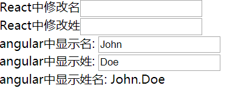

# react-angular
An example of integrating angularJS in react.
在React项目中集成angularJS的demo。

## 项目运行(Probject running)

1.克隆项目到本地 : git clone https://github.com/smk108/react-angular.git

2.安装依赖环境 : npm install

3.启动项目 : npm run start        

4.打包项目 : npm run build

## 运行效果

demo比较简单，运行效果如图所示，当修改React中的input时，angularJS中的内容随之更新。

